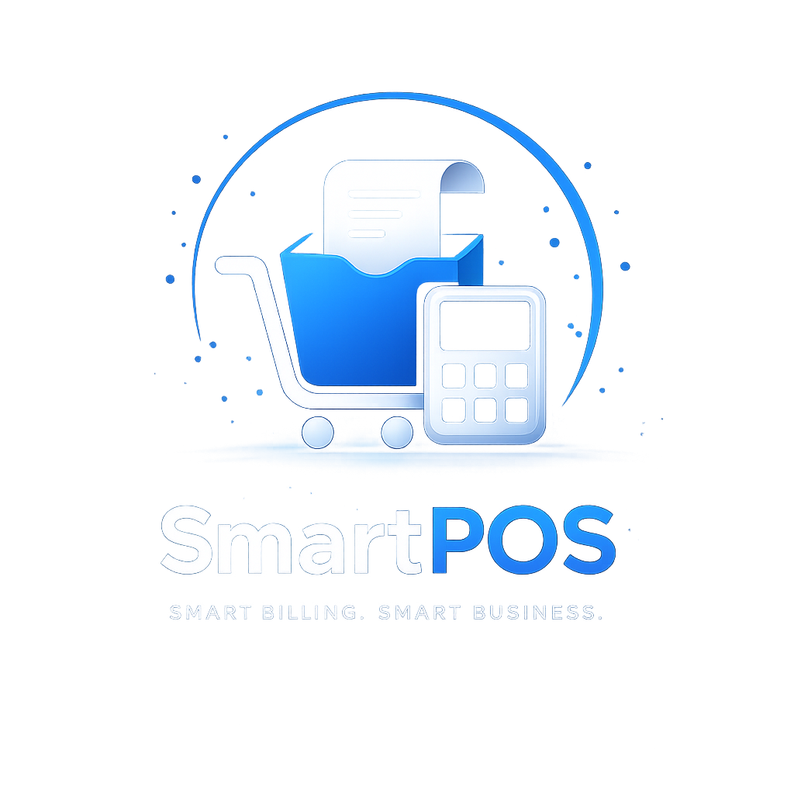
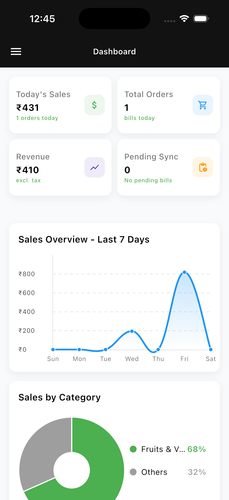
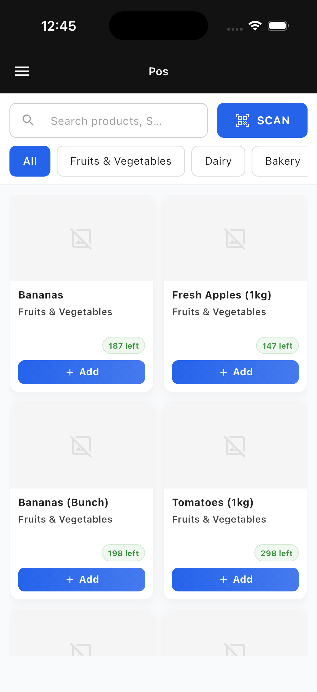
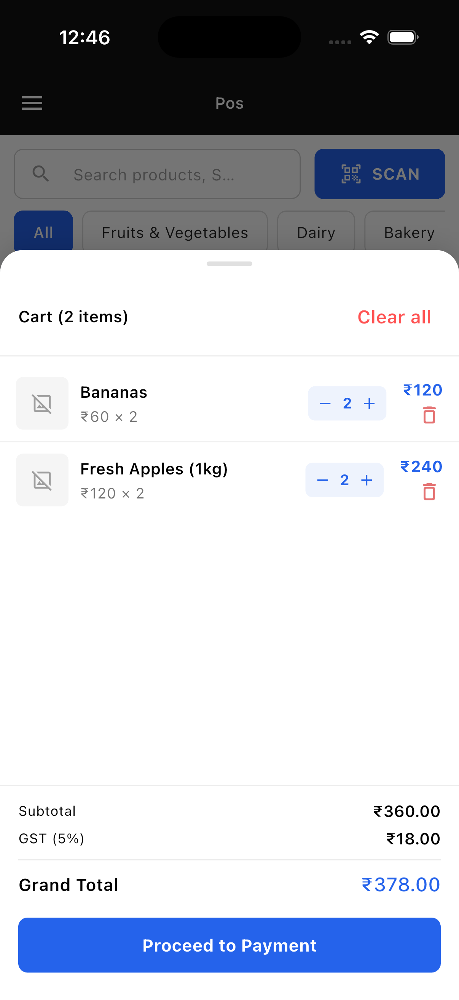
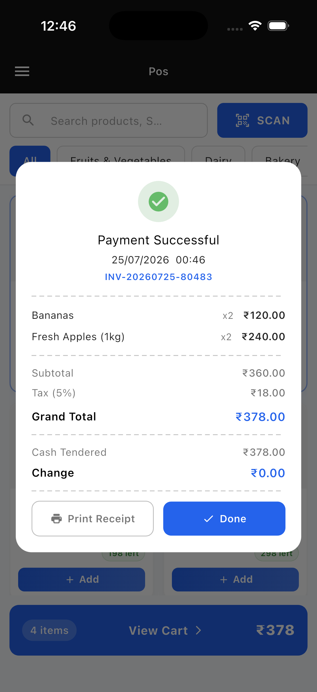
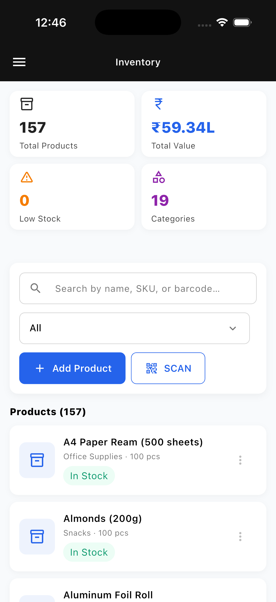

# SmartPOS – Offline First Point of Sale & Inventory Management System

<p align="center">
  
</p>

<p align="center">
A modern Flutter-based Point of Sale (POS) and Inventory Management System built using Clean Architecture, GetX, Hive, and Firebase.

Designed for small retail businesses with an offline-first approach, SmartPOS enables seamless billing, inventory management, analytics, and cloud synchronization while maintaining a responsive experience across mobile, tablet, and desktop.

</p>

---

## ✨ Features

### 🛒 Point of Sale

- Fast product search
- Barcode/QR scanning
- Add products to cart
- Quantity management
- Cash payment
- Receipt generation
- PDF receipt printing
- Offline bill generation
- Firebase synchronization

---

### 📦 Inventory Management

- Product management
- Category filtering
- SKU support
- Barcode support
- Search products
- Stock tracking
- Inventory analytics
- Refresh from Firebase
- Hive caching

---

### 📊 Dashboard

- Today's Sales
- Revenue
- Total Orders
- Pending Sync
- Weekly Sales Graph
- Category Distribution Chart

---

### ☁ Offline First

- Works without internet
- Bills stored locally using Hive
- Inventory cached locally
- Pending bills synchronized to Firebase
- Sync only offline-generated bills
- Manual synchronization support

---

### 🔐 Authentication

- Firebase Authentication

---

### 📱 Responsive Design

- Mobile
- Tablet
- Desktop
- Material 3 Design
- Adaptive layouts

---

## 🏗 Architecture

SmartPOS follows a Feature-first Clean Architecture.

```
Presentation
       │
       ▼
Controllers (GetX)
       │
       ▼
Use Cases
       │
       ▼
Repository
       │
       ▼
Data Sources
       │
 ┌─────┴───────────┐
 ▼                 ▼
Hive          Firebase
```

Each feature is divided into:

```
feature
├── data
├── domain
└── presentation
```

This architecture keeps business logic independent from UI and external services.

---

## 📁 Project Structure

```
lib
│
├── app
├── core
│   ├── config
│   ├── di
│   ├── firebase
│   ├── network
│   ├── services
│   └── utils
│
├── features
│   ├── authentication
│   ├── dashboard
│   ├── inventory
│   ├── pos
│   └── user
│
└── main.dart
```

---

## 🚀 Tech Stack

### Framework

- Flutter

### Language

- Dart

### State Management

- GetX

### Dependency Injection

- GetIt

### Local Storage

- Hive

### Backend

- Firebase Authentication
- Cloud Firestore

### Connectivity

- internet_connection_checker_plus

### Charts

- fl_chart

### Barcode Scanner

- mobile_scanner

### PDF

- pdf
- printing

### Architecture

- Clean Architecture
- Repository Pattern

---

## 🔄 Offline Workflow

```
Customer Checkout
        │
        ▼
Generate Bill
        │
        ▼
Save Bill to Hive
        │
        ▼
Internet Available?
      /     \
    Yes      No
    │         │
Upload      Mark Pending
Firebase        │
    │           │
    └─────Sync Later──────►
```

Only bills created while offline are synchronized once connectivity is restored.

---

## 📷 Screenshots

### Dashboard



### POS



### Cart



### Receipt



### Inventory



---

## ⚡ Performance Optimizations

- Feature-first modular architecture
- Lazy loading of product lists
- Hive local caching
- Efficient GetX state management
- Repository abstraction
- Responsive layouts
- Minimal widget rebuilds

---

## 🧪 Testing

The project includes unit and widget tests covering:

- Repository layer
- Business use cases
- Inventory management
- Billing calculations
- Dashboard widgets
- POS interactions

Run tests:

```bash
flutter test
```

---

## 🔧 Getting Started

Clone repository

```bash
git clone <repository-url>
```

Install packages

```bash
flutter pub get
```

Run

```bash
flutter run
```

## Future Improvements

- Automatic background synchronization
- Push notifications
- Multi-store support
- Customer management
- Sales reports export
- Role-based access control
- Cloud backup scheduling

---

## Author

**Kartik Dhiman**

Flutter Developer

- Flutter
- Firebase
- GetX
- Clean Architecture
- Offline First Applications

---

## License

This project is developed for educational and portfolio purposes.
